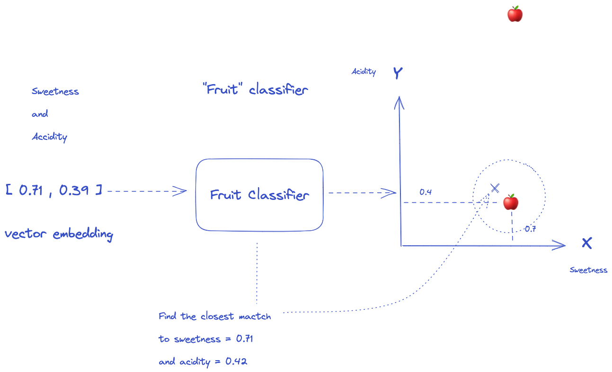
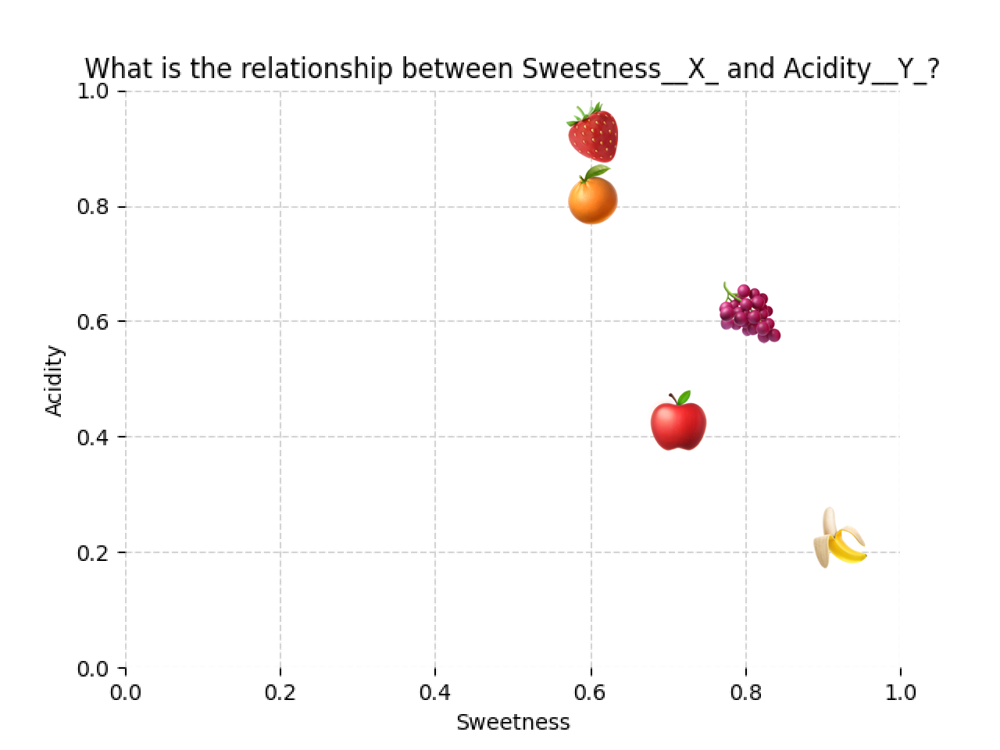

# Demystifying Classifiers and Embeddings

## Information

| Author         | Created    | Updated    | Version |
| -------------- | ---------- | ---------- | ------- |
| Raphaël MANSUY | 07/09/2023 | 07/09/2023 | 0.0.1   |

## Introduction

Classifiers and embeddings are two important techniques used in machine learning for natural language processing tasks.

Classifiers are algorithms that assign data points to different categories or classes.

A simple example is a model that classifies fruits on a 2D plot of sweetness versus acidity. However, real-world classification tasks are often high-dimensional and require complex models and data representations.

There are many classifier architectures like neural networks, SVMs, random forests etc. that have tradeoffs in accuracy, interpretability and efficiency.

Embeddings are vector representations of words, sentences or images that capture semantic meaning and relationships. They are usually learned by training neural networks on large datasets rather than manually engineered. Embeddings serve as input features to classifiers and other downstream models, allowing them to operate on dense vectors rather than sparse raw inputs like text.

While conceptually distinct, classifiers and embeddings work closely together in modern NLP and computer vision systems. Embeddings provide meaningful representations as input to classifiers and other models. Choices of embedding and classifier architectures impact overall performance. There are still many open challenges in designing optimal embeddings and classifiers for real-world applications.

## A short introduction to classifiers and embeddings

Suppose we choose a space with 2 dimensions:

- x-axis: The level of sweetness
- y-axis: The level of acidity

And we try to encode a set of fruits according to theses characteristics.

| Fruit Name | Emoji |
| ---------- | ----- |
| Apple      | 🍎    |
| Orange     | 🍊    |
| Banana     | 🍌    |
| Grape      | 🍇    |

**Encoders**:

Encoders are algothms that take as input a discrete item, such as a word, and outputs a vector of continuous values.

- **For language analysis**: the vector values are learned in relation to other words in the vocabulary, so that words that share common contexts in the corpus are located in close proximity to one another in the vector space.
- **For pictures or comptuer vision tasks**: the vector values are learned in relation to other pictures in the dataset, so that pictures that share common features in the dataset are located in close proximity to one another in the vector space.

**Classifiers**:

Classifiers are algorithms that assign data points to different categories or classes. In this example, the classifier is a simple 2D plot of sweetness versus acidity that can be used to find the correct fruit. However, real-world classification tasks are often high-dimensional and require complex models and data representations.

**The full classification of fruits is shown below**:

[

Specifically, the classifier here outputs two values - the x coordinate representing sweetness, and the y coordinate representing acidity. By mapping fruits to locations in this 2D space, the classifier is categorizing the fruits based on their levels of sweetness and acidity.

**Some key properties of this encoder**:

- **Inpu**t: Name of a fruit (Apple, Orange, etc)
- **Output**: 2D coordinates (x,y) representing sweetness and acidity levels
- **Mapping**: Assigns fruits to locations in 2D plot based on inherent properties of sweetness and acidity
- **Categories**: Divides fruits into regions of the 2D space based on sweetness and acidity levels

Classifiers play a key role in supervised learning, allowing models to learn patterns from data and then apply those learnings to categorize new data points. They are essential tools for tasks like image recognition, document classification, and many other applications.

## What are Embeddings ?

Embeddings in the context of machine learning are vector representations of words, sentences, or images that capture semantic meaning and relationships. They are learned by training neural networks on large datasets, rather than being manually engineered.

For computer vision tasks, embeddings are learned in relation to other images in the dataset. This allows similar images to be located close to each other in the vector space. For example, if two images have similar features, their embeddings will be close together.

In the context of Large Language Models (LLMs), embeddings represent words as vectors of numbers that encode their meaning and relationships to other words. LLMs understand that similar words have similar embeddings. Embeddings reduce the dimensionality of language, transforming sparse, high-dimensional text data into dense, low-dimensional vectors. This enables tasks like sentiment analysis.

**Some key properties of embeddings**:

- **Input**: Discrete item (word, user, product, etc)
- **Output**: Vector of continuous values
- **Mapping**: Assigns items to locations in vector space based on context
- **Categories**: Divides items into regions of the vector space based on context

**Key points embeddings in the context of LLMs (Large Language Models)**:

- Embeddings represent words as **vectors of numbers** that encode their **meaning and relationships** to other words
- This allows models to understand that **similar words** have **similar embeddings**.
- Embeddings **reduce the dimensionality of language**, transforming sparse, high-dimensional text data into **dense, low-dimensional vectors**
- This makes it feasible to **train models on huge datasets**.
- Embeddings capture semantics, meaning if two words have similar embeddings, the model understands they have **similar meanings**: this enables tasks like **sentiment analysi**s.
- Earlier models like **Word2Vec** generated **static embeddings**, but modern models like **BERT** learn **contextual embeddings** which better capture nuance
- Embeddings are combined through operations like **averaging** to obtain **sentence-level** and **document-level** representations

In the context of large language models (LLMs), embeddings play a crucial role in capturing the meanings of text and transforming text into a hyperspace with n dimensions of meaning.
By representing words as vectors of numbers that encode their meaning and relationships to other words, LLMs can understand that similar words have similar embeddings.

## Mathematical Manipulation of Meaning: How Vector Representations Revolutionize Language Analysis

Because words and sentences can be represented as vectors, language takes on a mathematical structure.

Vectors are mathematical objects that can be combined through operations like addition and multiplication.

So by transforming text into vectors, we unlock the ability to mathematically manipulate meaning for the first time.

We can take the vector for "king" and subtract the vector for "man" to get something close to the vector for "queen".

This reveals an underlying structure where related concepts are mapped to similar vectors.

By applying mathematical operations on these word and sentence vectors, we can now do algebra, calculus, and more on the latent meanings they represent.

This mathematical framework powers our ability to analyze and generate language in entirely new ways.

Vector representations are a profound leap forward, enabling us to mathematically reason about the semantics of language.
