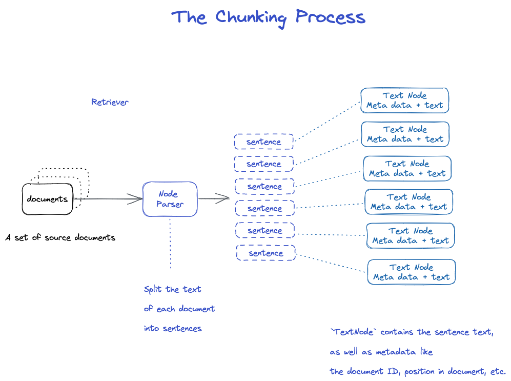
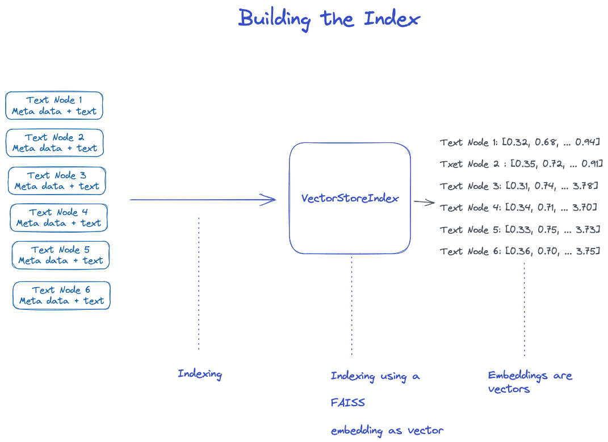
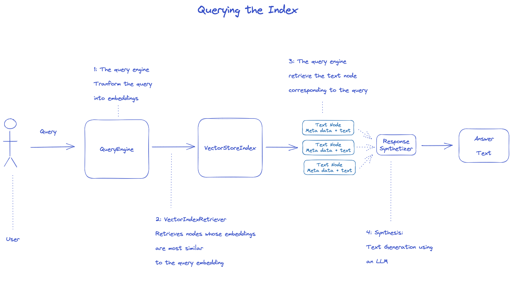

# LlamaIndex 🦙

## What is LlamaIndex ?

LlamaIndex is a Python library created by [Jerry Liu](https://www.linkedin.com/in/jerry-liu-64390071/) that enables efficient text search and summarization over large document collections using language models.

Developers can use LLamaIndex to quickly add private/custom data to enhance existing LLMs. It avoids the need to retrain models, while allowing them to provide personalized and data-driven responses.


**Problem it solves**:

LlamaIndex addresses the challenges of scaling language models to large document collections. Language models have limited context sizes, which makes processing entire large documents expensive. Additionally, retrieving information from large document collections through keyword search over raw text is inefficient at scale.

To overcome these challenges, LlamaIndex employs two key strategies. Firstly, it chunks documents into smaller contexts such as sentences or paragraphs, which are referred to as Nodes. These Nodes can be efficiently processed by language models. Secondly, LlamaIndex indexes these Nodes using vector embeddings, enabling fast and semantic search.

By chunking documents and leveraging vector embeddings, LlamaIndex enables scalable semantic search over large datasets. It achieves this by retrieving relevant Nodes from the index and synthesizing responses using a language model.

**Examples**:

- Summarize a 1GB dataset by querying for a summary. LlamaIndex retrieves relevant Nodes and synthesizes a summary.
- Find documents mentioning a person by embedding the name and retrieving similar Nodes.
- Extract entities like locations from the dataset by querying for them.
- Document QA by querying for answers to questions.
- Data Augmented Chatbots by querying for responses to user messages.
- LlamaIndex enables knowledge agents to autonomously retrieve and make informed decisions using efficient semantic search on large document collections.
- Structured Analytics by querying for structured data like tables, CSV files, Databases, etc.

**Examples of real applications built with LlamaIndex**:

| Name         | Demo Link                                             | Github Link                                         | Description                                                                                                                                |
| ------------ | ----------------------------------------------------- | --------------------------------------------------- | ------------------------------------------------------------------------------------------------------------------------------------------ |
| SEC Insights | [run-llama/sec-insights](https://www.secinsights.ai/) | [Github](https://github.com/run-llama/sec-insights) | SEC Insights uses the Retrieval Augmented Generation (RAG) capabilities of LlamaIndex to answer questions about SEC 10-K & 10-Q documents. |

**Key Benefits**:

- Scales LM-powered search to large text collections.
- Fast semantic retrieval via vector embeddings.
- Modular architecture to customize chunking, embeddings, retrieval.

So in summary, LlamaIndex enables efficient semantic search and summarization at scale by chunking data into Nodes, indexing with vectors, and querying with an LM. The modular design allows customization for different use cases.

## RAG vs LlamaIndex

LLamaIndex can be used to implement a RAG (Retrieval-Augmented Generation) model. This is a model that uses a retriever to retrieve relevant nodes from an index, and then uses a generator to generate a response from the retrieved nodes.

Retrieval Augmented Generation combines retrieval and text generation to produce more grounded and accurate text. At its core, RAG uses a retrieval module to find relevant information from external knowledge sources. This retrieved context is then fed as additional input to augment a text generation module, typically a large pretrained language model.

The main advantage of RAG is that it grounds the generator on factual knowledge, reducing hallucination issues common in unchecked language models. By retrieving relevant information to augment the input, the generator can stay focused on the given context and produce more accurate, up-to-date responses.

During inference, the user's query is first passed to the retriever, which searches over documents or a database to find pertinent information. This context is concatenated with the original query to form an expanded input to the generator. The generator can then leverage both the user query and retrieved knowledge when producing the final response.

RAG utilizes pretrained models for efficiency - the retriever and generator are usually initialized from existing dense retrieval and seq2seq models. The full RAG model can then be fine-tuned end-to-end for a downstream task. This provides an efficient way to imbue language models with external knowledge, without costly retraining.

A key advantage is that the retriever module can be updated easily with new documents or knowledge. This allows RAG models to stay current and topical. The modular architecture also allows customizing and optimizing each component independently.

## How to use LlamaIndex ?

LlamaIndex enables scalable text search and summarization by chunking documents into smaller nodes, indexing them for efficient retrieval, and synthesizing responses using a language model.

**Steps involved in using LlamaIndex:**

| Step Number | Step Name                 | Step Description                                                                |
| ----------- | ------------------------- | ------------------------------------------------------------------------------- |
| 1           | Load Documents            | Load in data as Document objects, either manually or through a data loader      |
| 2           | Parse into Nodes          | Parse Document objects into Node objects to represent chunks of data            |
| 3           | Index Construction        | Build an index over the Documents or Nodes                                      |
| 4           | Insert Documents/Nodes    | Insert additional Documents or Nodes into the index after construction          |
| 5           | Query the Index           | Query the index using a QueryEngine to retrieve relevant Nodes                  |
| 6           | Parse/Synthetize Response | The response is a Response object containing the text response and source Nodes |

The key steps are loading in data as Documents, parsing into Nodes, constructing an index over the Documents/Nodes, querying the index to retrieve relevant Nodes, and then parsing the Response object. The index can also be persisted and reloaded from disk.

```mermaid
graph TD;
    A[Load Documents] --> B[Parse into Nodes];
    B --> C[Index Construction];
    C --> D[Insert Documents/Nodes];
    D --> E[Query the Index];
    E --> F[Parse/Synthetize the Response];
```

**Example of code**:

```python
"""
This module provides an example of using the llama_index library to load and query documents.
"""
from llama_index import VectorStoreIndex, SimpleDirectoryReader

# Load in data as Document objects, either manually or through a data loader
documents = SimpleDirectoryReader('data').load_data()

# Parse Document objects into Node objects to represent chunks of data
index = VectorStoreIndex.from_documents(documents)


# Build an index over the Documents or Nodes
query_engine = index.as_query_engine()

# The response is a Response object containing the text response and source Nodes
summary = query_engine.query("What is the text about")
print("What is the data about:")
print(summary)

person = query_engine.query(
    "Extract all the person in the content, format as JSON with a lastname"
    " and first_name property")
print(person)


location = query_engine.query(
    "Extract all the location in the content, format as JSON with a name"
    " and the country")
print(location)
```

**Result**:

```text
The context does not provide any information about what the author did growing up.
What is the data about:
The text is about the author's experiences and reflections during their time at art school and their decision to pursue a career in painting.
{"persons": [
  {"last_name": "Graham", "first_name": "Paul"},
  {"last_name": "McCarthy", "first_name": "John"}
]}
{"locations": [
  {"name": "New York City", "country": "United States"},
  {"name": "Upper East Side", "country": "United States"},
  {"name": "Yorkville", "country": "United States"},
  {"name": "Cambridge", "country": "United States"},
  {"name": "England", "country": "United Kingdom"},
  {"name": "Florence", "country": "Italy"},
  {"name": "Piazza San Felice", "country": "Italy"},
  {"name": "Pitti", "country": "Italy"},
  {"name": "Orsanmichele", "country": "Italy"},
  {"name": "Duomo", "country": "Italy"},
  {"name": "Baptistery", "country": "Italy"},
  {"name": "Via Ricasoli", "country": "Italy"},
  {"name": "Piazza San Marco", "country": "Italy"}
]}

```

[Example of code](./01_lama_example.py)

## How it works ?

Here is a detailed explanation of how LlamaIndex works under the hood:

## Chunking Process

LlamaIndex breaks down input documents into smaller chunks called nodes. This chunking is done by the `NodeParser`. By default, the `SimpleNodeParser` is used which chunks documents into sentences.

The chunking process works as follows:

- The `NodeParser` takes in a list of `Document` objects.
- It splits the text of each `Document` into sentences using spaCy's sentence segmentation.
- Each sentence is wrapped in a `TextNode` object, which represents a node.
- The `TextNode` contains the sentence text, as well as metadata like the document ID, position in document, etc.
- The list of `TextNode` objects is returned.

## Converting Chunks to Embeddings and Nodes

The list of `TextNode` objects is then passed to the index for embedding.

- For each `TextNode`, the text is encoded into a vector embedding using a sentence transformer model like `all-mpnet-base-v2`.
- This embedding is stored in the `TextNode` object.
- The `TextNode` with its embedding and metadata is now considered a `Node` object that can be indexed.



## Building the Index

The index is built over the list of `Node` objects.

- For `VectorStoreIndex`, the nodes are stored in a FAISS index using the text embeddings as vectors. This enables fast similarity search over the nodes.
- The index also stores metadata on each node like the document ID, position, etc.
- The nodes are indexed based on the document they belong to. This allows retrieving nodes for a specific document.

FAISS (Facebook AI Similarity Search) is a library developed by Facebook AI that enables efficient similarity search and clustering of dense vectors. It contains algorithms that search in sets of vectors of any size, up to billions of vectors. FAISS is built around an index type that stores a set of vectors and provides a function to search in them with L2 (Euclidean) and/or dot product vector comparison.



## Querying the Index

To query the index, a `QueryEngine` is used.

- A `Retriever` fetches relevant nodes from the index for the query. For example, `VectorIndexRetriever` retrieves nodes whose embeddings are most similar to the query embedding.

- The list of retrieved nodes is passed to a `ResponseSynthesizer` to generate the final response.

- By default, the response synthesizer sequentially processes each node, making an API call to the LLM for each node.

- The LLM call passes the query and node text, and returns the response.

- These per-node responses are aggregated into the final response string.

So in summary, the index allows fast retrieval of relevant nodes using embeddings, which are then synthesized into a response using the LLM. The modular architecture allows customizing each component like the chunking, embeddings, retrieval, and synthesis.



## How to install LLamaIndex ?

This a possible workflow to install LlamaIndex:

1 - Create a conda environment called llama_index

```bash
conda create --name llama_index python=3.11
```

2 - Activate the environment

```bash
conda activate llama_index
```

3 - Install the package

```bash
pip install llama-index
```

And then you are good to go!

## Advanced Usage

🏗️ To be written

## LLamaIndex 🦙 vs LangChain 🔗 🦜

LlamaIndex and LangChain are two open-source tools that leverage large language models for different purposes. LlamaIndex focuses on search and summarization by indexing data sources and retrieving relevant information from them using LLMs. LangChain provides a more general framework for building conversational agents and other applications with LLMs, with tools for managing prompts, memory, and conversational context.

**Some key differences**:

- LlamaIndex specializes in optimized indexing and retrieval of data for search/QA applications. LangChain has more basic search capabilities but gives more flexibility for building complex conversational agents.
- LlamaIndex integrates LLMs tightly with data sources. LangChain allows combining LLMs, external APIs, and tools like LlamaIndex.
- LlamaIndex provides granular control over indexing/retrieval. LangChain focuses more on prompt engineering, memory, and conversational context.
- LlamaIndex is optimized for search/QA applications. LangChain is better for general purpose agents and bots.

In summary, LlamaIndex excels at search while LangChain provides a flexible platform for conversational AI. Using both together can combine optimized search from LlamaIndex with LangChain's capabilities for context and conversation. The choice depends on whether the main goal is search/QA or more complex conversational applications.

## Resources

Here is a table with resources about LlamaIndex:

| Resource Num | Name                                             | Description                                                                                             | Link to the resource                               |
| ------------ | ------------------------------------------------ | ------------------------------------------------------------------------------------------------------- | -------------------------------------------------- |
| 1            | LlamaIndex 0.8.20 - Read the Docs                | A data framework for LLM applications to ingest, structure, and access private or domain-specific data. | [Read the Docs](https://gpt-index.readthedocs.io)  |
| 2            | LlamaIndex - Hugging Face                        | A central interface to connect your LLMs with external data.                                            | [Hugging Face](https://huggingface.co/llamaindex)  |
| 3            | jerryjliu/llama_index on GitHub                  | LlamaIndex (GPT Index) is a data framework for your LLM applications.                                   | [GitHub](https://github.com/jerryjliu/llama_index) |
| 4            | LlamaIndex - Data Framework for LLM Applications | A simple, flexible data framework for connecting custom data sources to large language models.          | [LlamaIndex.ai](https://www.llamaindex.ai)         |
